## 概要

このアプリは、精神科の受診を検討している方が、自分に合った医療機関を検索・比較できることを目的としたWebアプリケーションです。

精神科医療の多くは予約制であり、医療機関ごとに得意とする分野や対象疾患が異なります。
作成者自身が実際に精神科病院で勤務してきた経験から、「精神科に特化した情報を一元的に整理し、患者さんがスムーズに受診先を検討できるサービスが必要ではないか」と感じ、このアプリを開発しました。

現在はMVP（Minimum Viable Product）開発段階が完了しており、病院情報はダミーデータで構成されています。
今後はポートフォリオ用途に向けて、実在する医療機関の情報を反映する予定です。

## スクリーンショット

### トップページ

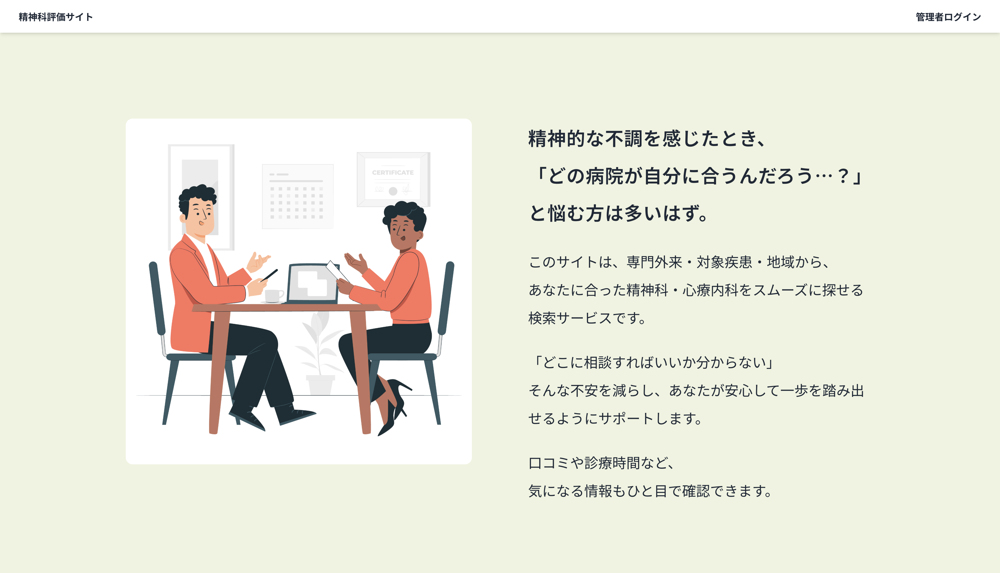
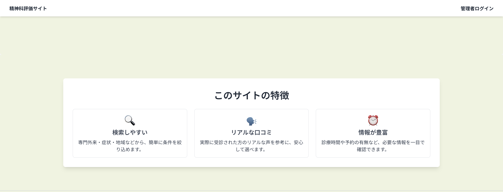

### 検索機能
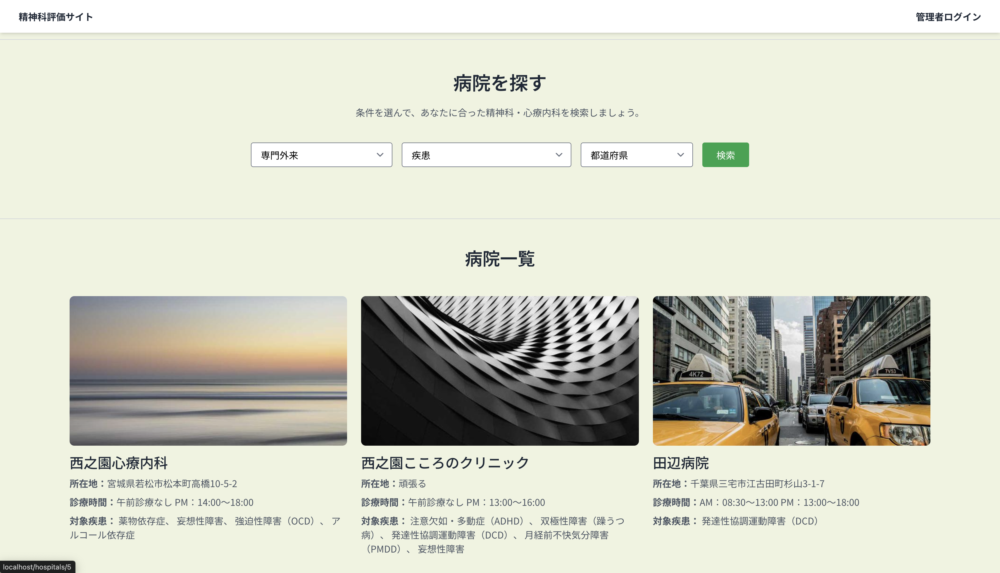

### 検索結果

### 詳細画面

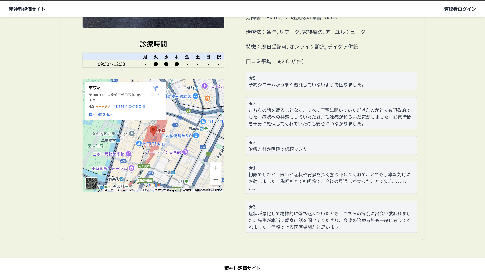

### ログイン画面
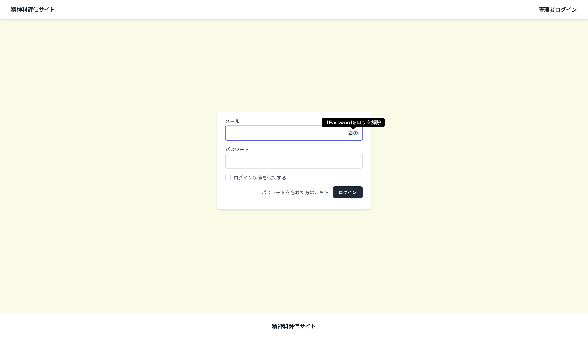

### 管理画面
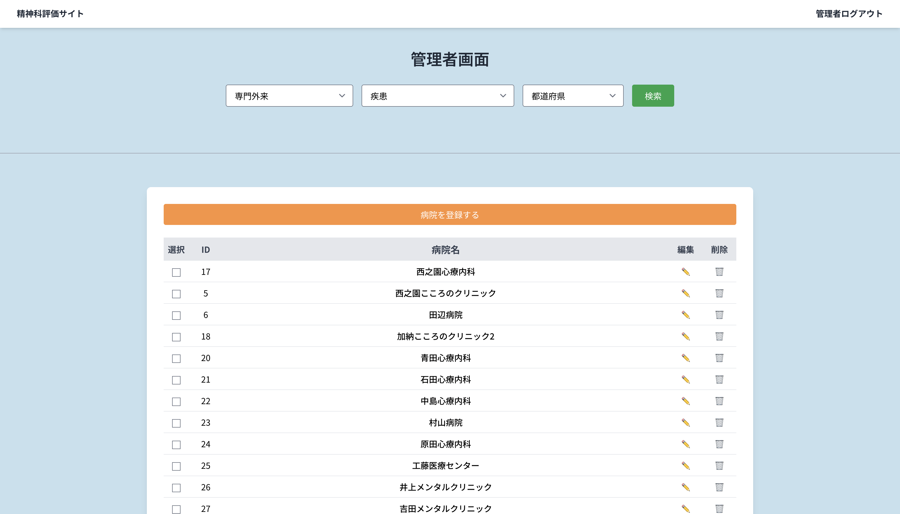

### 管理画面(病院新規登録)
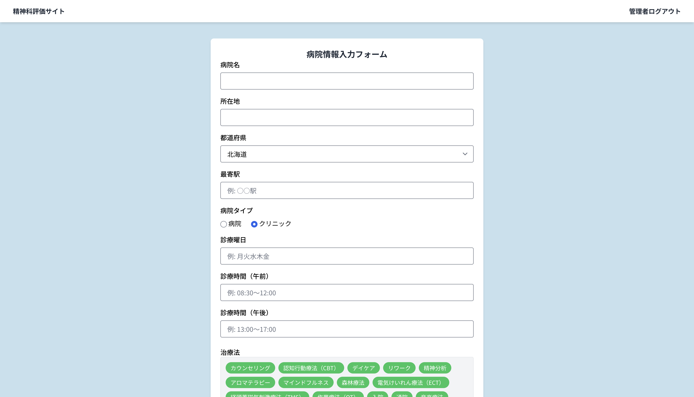

### 管理画面（詳細画面）
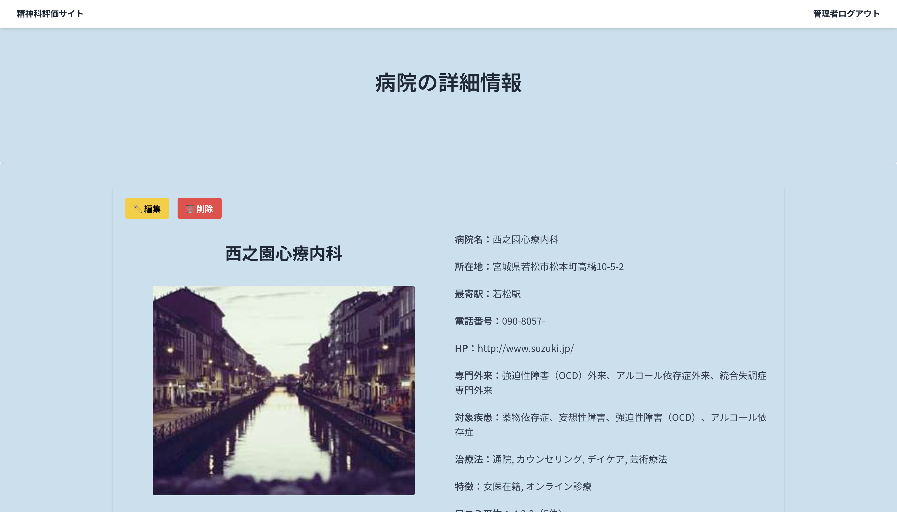

### 管理画面（編集画面）
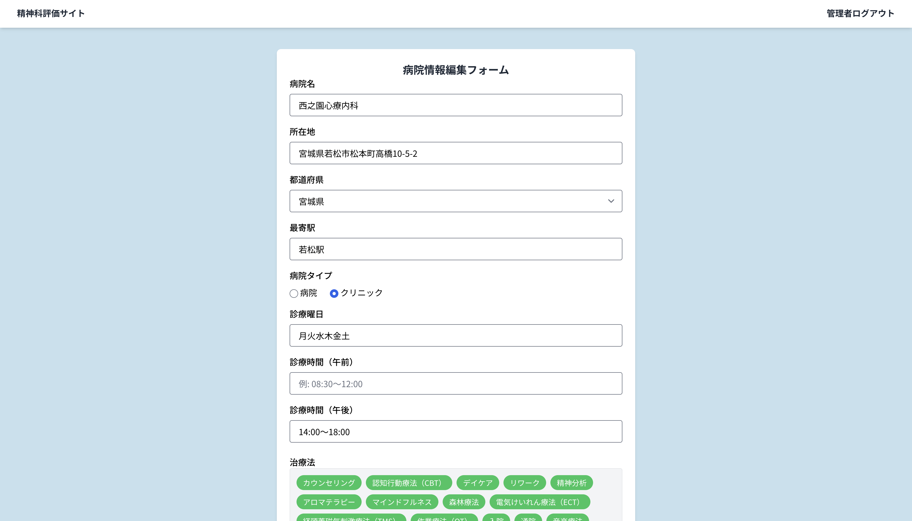

## 主な機能

### ①病院検索機能(ユーザーは専門外来、疾患、都道府県から探せます)
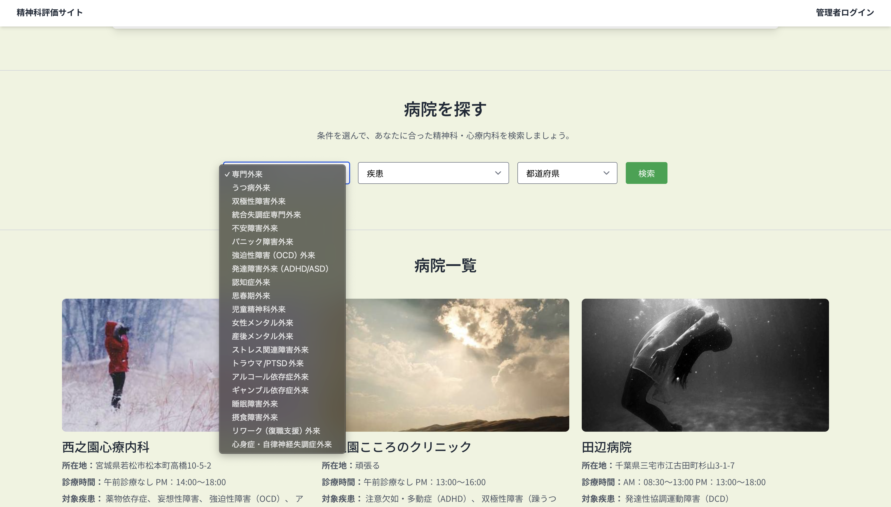

### ②病院の口コミが見れます。

### 管理者画面から病院の登録、編集、削除ができます。

## 使用技術

### バックエンド
・ PHP 8.2
・ Laravel 12（Sail環境、Breezeによる認証機能）
・ Composer（PHPパッケージ管理）

### フロントエンド
・ HTML5
・ Blade（Laravel標準のテンプレートエンジン）
・ Tailwind CSS（ユーティリティファーストCSSフレームワーク）
・ JavaScript（ES6+）

### データベース
・ PostgreSQL
・ Laravelのマイグレーション／Seeder／Factoryを活用し、ダミーデータ生成を実施

## 開発環境
・ Docker / Laravel Sail
・ Git / GitHub

## その他
・ 本アプリは現在ローカル環境（Laravel Sail + PostgreSQL）にて開発・動作確認を行っており、今後ポートフォリオとして外部公開するために、デプロイ環境の整備を予定しています。
・ 表示されている病院の画像は、あくまでテスト用途であり、以下のような一時的なダミー画像サービスを利用しています
&lt;img src="https://picsum.photos/seed/sample123/600/400" alt="ダミー画像"&gt;
そのため、画像の読み込みに時間がかかる場合があります。
また、表示されないこともありますが、その場合はページをリロード（再読み込み）していただくことで改善されます。
ポートフォリオでは実際の病院の画像に差し替える予定です。

## ER図
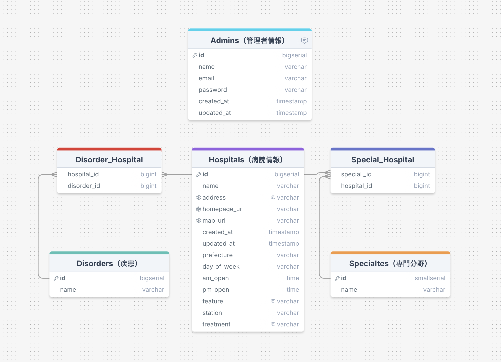
